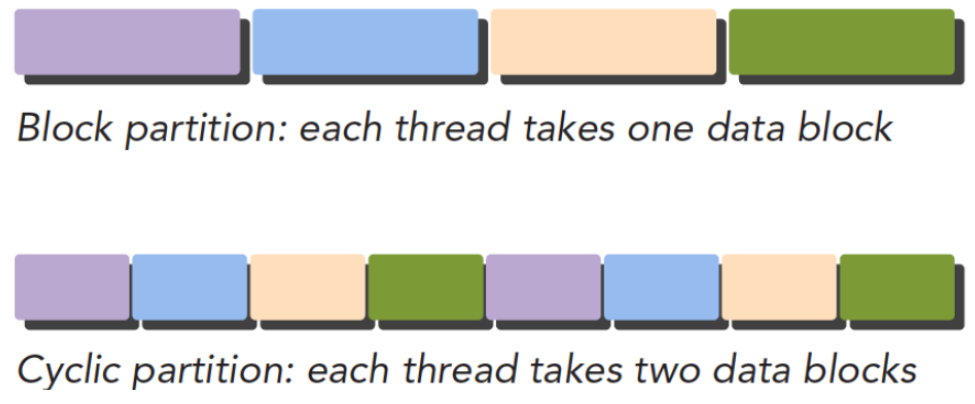
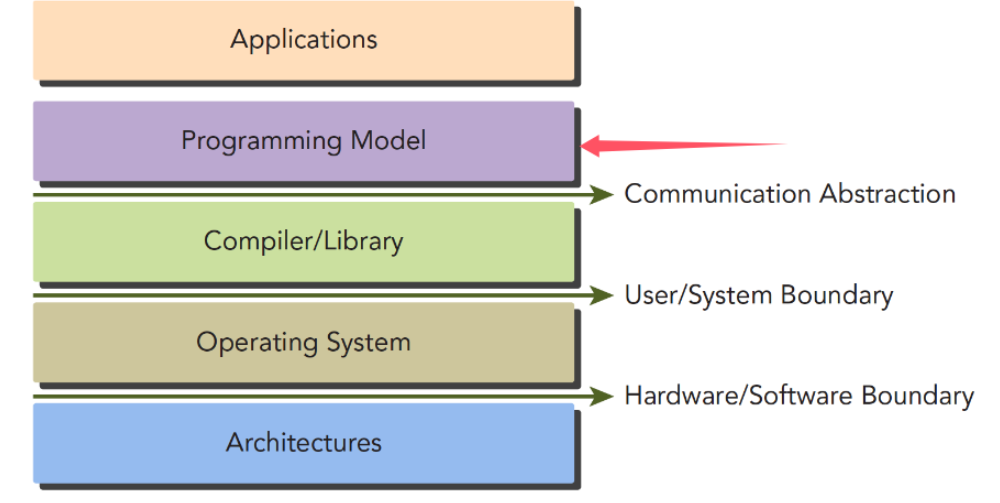
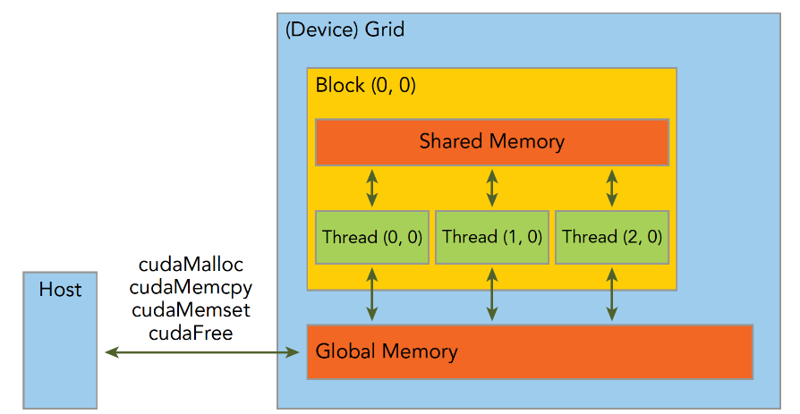
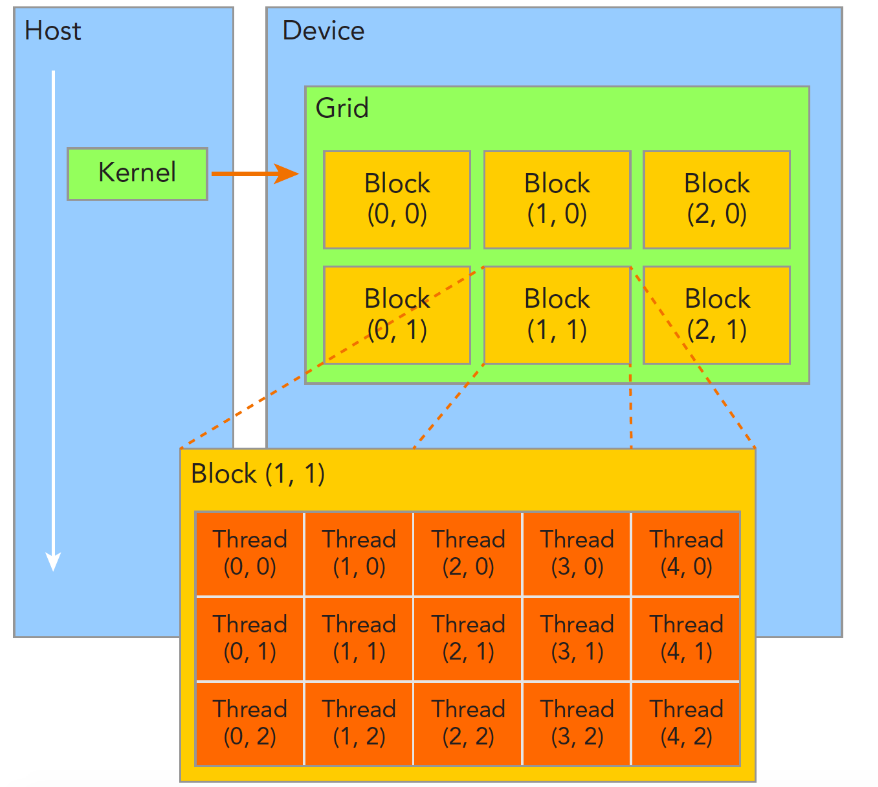
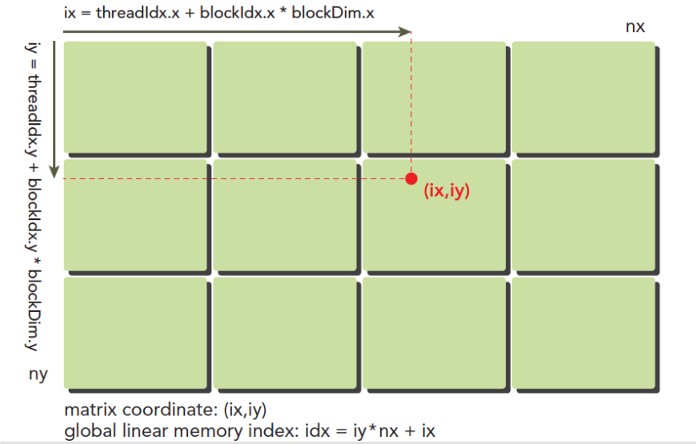
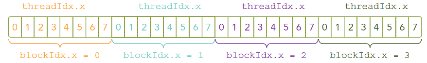
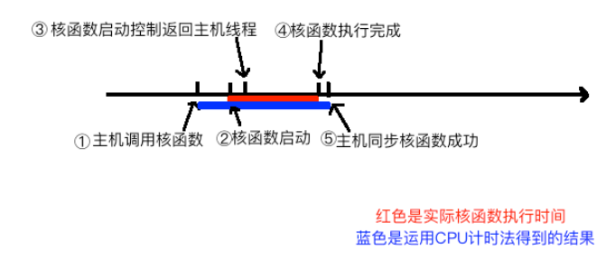
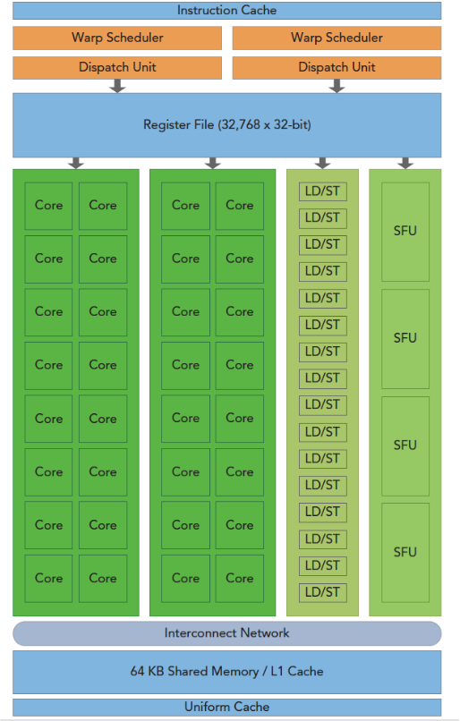
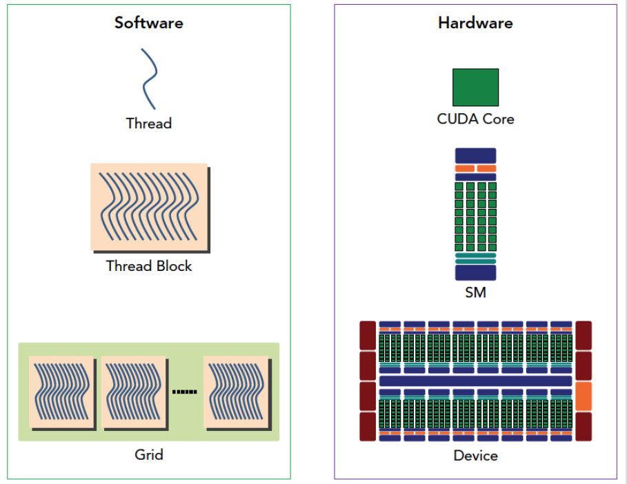

https://github.com/DefTruth/CUDA-Learn-Notes：使用cuda手写各种LLM 内核的。

https://github.com/Tony-Tan/CUDA_Freshman：入门级别的资料。可以多看看


# 1. Basic notes

## 1.1 并行计算

并行计算的两种方法：块划分与周期划分。

+ 块划分：把数据划分为N个小块，每个小块（或者t个小块合并）提交到一个thread计算。

| thread |    1    |    2    |    3    |     4      |
| :----: | :-----: | :-----: | :-----: | :--------: |
| block  | 1, 2, 3 | 4, 5, 6 | 7, 8, 9 | 10, 11, 12 |

+ 周期划分：线程按照顺序处理相邻的数据块，每个线程处理多个数据块。



这个示意图中，每个带颜色的块表示**一个线程**。


## 1.2 计算机架构分类

划分不同计算机结构的方法有很多，广泛使用的一种被称为佛林分类法Flynn’s Taxonomy，他根据指令和数据进入CPU的方式分类，分为以下四类：


分别以数据和指令进行分析：

- 单指令单数据SISD（传统串行计算机，386）
- 单指令多数据SIMD（并行架构，比如向量机，所有核心指令唯一，但是数据不同，现在CPU基本都有这类的向量指令）
- 多指令单数据MISD（少见，多个指令围殴一个数据）
- 多指令多数据MIMD（并行架构，多核心，多指令，异步处理多个数据流，从而实现空间上的并行，MIMD多数情况下包含SIMD，就是MIMD有很多计算核，计算核支持SIMD）


我们验证加速效果的指标有：

- 降低延迟：指操作从开始到结束所需要的时间，一般用微秒计算，延迟越低越好。
- 提高带宽：单位时间内处理的数据量，一般用MB/s或者GB/s表示。
- 提高吞吐量：单位时间内成功处理的运算数量，一般用gflops来表示。

注：吞吐量和延迟有一定关系，都是反应计算速度的，一个是时间除以运算次数，得到的是单位次数用的时间–延迟，一个是运算次数除以时间，得到的是单位时间执行次数–吞吐量。


衡量GPU计算能力的主要靠下面两种**容量**特征：

- CUDA核心数量（越多越好）
- 内存大小（越大越好）

相应的也有计算能力的**性能**指标:

- 峰值计算能力
- 内存带宽


## 1.3 杂项

一个CUDA应用通常可以分解为两部分，

- CPU 主机端代码
- GPU 设备端代码


## 1.4 初识code

```cpp
    int *dev_a = 0;
    int *dev_b = 0;
    int *dev_c = 0;
    cudaError_t cudaStatus;

    // Choose which GPU to run on, change this on a multi-GPU system.
    cudaStatus = cudaSetDevice(0);
    if (cudaStatus != cudaSuccess) {
        fprintf(stderr, "cudaSetDevice failed!  Do you have a CUDA-capable GPU installed?");
        goto Error;
    }

    // Allocate GPU buffers for three vectors (two input, one output)    .
    cudaStatus = cudaMalloc((void**)&dev_c, size * sizeof(int));
    if (cudaStatus != cudaSuccess) {
        fprintf(stderr, "cudaMalloc failed!");
        goto Error;
    }

    cudaStatus = cudaMalloc((void**)&dev_a, size * sizeof(int));
    if (cudaStatus != cudaSuccess) {
        fprintf(stderr, "cudaMalloc failed!");
        goto Error;
    }

    cudaStatus = cudaMalloc((void**)&dev_b, size * sizeof(int));
    if (cudaStatus != cudaSuccess) {
        fprintf(stderr, "cudaMalloc failed!");
        goto Error;
    }
```

这一段代码，就是设置device指针，然后有一句`cudaSetDevice(0)`很重要，关系到程序的同步。

后面三个就分别是malloc的过程了。

__问题：__

+ 为什么cudaMalloc接受二级指针作为参数呢？
  + 因为一级指针是代表**一串数据（向量）的起始地址。要获得它的地址，才能进行malloc。**
+ 为什么要把指针强转为`void`类型呢？
  + 因为指针的类型只是决定它读取数据的方式，但是在这里我们不需要读取数据，只需要分配内存，所以使用void类型指针。再者，人家API设计的就是接受void类型指针，所以需要强转一下。


```cpp
addKernel<<<1, size>>>(dev_c, dev_a, dev_b);
```

发射，运算。


```cpp
    // Check for any errors launching the kernel
    cudaStatus = cudaGetLastError();
    if (cudaStatus != cudaSuccess) {
        fprintf(stderr, "addKernel launch failed: %s\n", cudaGetErrorString(cudaStatus));
        goto Error;
    }
    
    // cudaDeviceSynchronize waits for the kernel to finish, and returns
    // any errors encountered during the launch.
    cudaStatus = cudaDeviceSynchronize();
    if (cudaStatus != cudaSuccess) {
        fprintf(stderr, "cudaDeviceSynchronize returned error code %d after launching addKernel!\n", cudaStatus);
        goto Error;
    }

    // Copy output vector from GPU buffer to host memory.
    cudaStatus = cudaMemcpy(c, dev_c, size * sizeof(int), cudaMemcpyDeviceToHost);
    if (cudaStatus != cudaSuccess) {
        fprintf(stderr, "cudaMemcpy failed!");
        goto Error;
    }

Error:
    cudaFree(dev_c);
    cudaFree(dev_a);
    cudaFree(dev_b);
    
    return cudaStatus;
```

在这里，就是把刚才的数据拷贝回来。

我们注意到，cudaMemcpy其实还有第四个参数，那就是**方向**。前面是H2D，现在是D2H


# 2. CUDA编程模型

Programming Model




GPU中大致可以分为：

- 核函数
- 内存管理
- 线程管理
- 流

具体来说有：

- 通过组织层次结构在GPU上组织线程的方法
- 通过组织层次结构在GPU上组织内存的方法


对于一个CUDA开发的流程来说，有：

1. 领域层：（也就是你所要解决问题的条件）分析数据和函数，以便在并行运行环境中能正确
2. 逻辑层：关注点应转向如何组织并发进程，这个阶段要从逻辑层面思考。
3. 硬件层


对于一个CUDA程序的运行来说：从host的串行到调用核函数。核函数被调用后控制马上归还主机线程，**也就是在第一个并行代码执行时，很有可能第二段host代码已经开始同步执行了。**


整份学习材料的研究路线是：

- 内存
- 线程
- 核函数
  - 启动核函数
  - 编写核函数
  - 验证核函数
- 错误处理


# 3. 内存

## 3.0 初探内存

CUDA提供的API可以分配管理设备上的内存，当然也可以用CUDA管理主机上的内存，主机上的传统标准库也能完成主机内存管理。

先从最简单的分配、拷贝、释放API入手。

| 标准C函数 | CUDA C 函数 |           参数           |                    说明                     |
| :-------: | :---------: | :----------------------: | :-----------------------------------------: |
|  malloc   | cudaMalloc  |     device指针、size     | 内存分配，不需要说明，因为直接就分配GPU内存 |
|  memcpy   | cudaMemcpy  | device，host，size，方向 |           内存复制，需要说明方向            |
|  memset   | cudaMemset  |            ？            |                  内存设置                   |
|   free    |  cudaFree   |        device指针        |                  释放内存                   |

对于cudaMemcpy函数，成功则会返回 cudaSuccess 否则返回 cudaErrorMemoryAllocation



不过这个图并不能准确概括内存的模型。

在CUDA编程中，`cudaMalloc`函数的参数是一个指向指针的指针（即二级指针），这是因为CUDA需要将分配的设备内存地址返回给调用者，并且在C++中，指针是按值传递的。


# 4. 线程

## 4.0 初探线程

**一个核函数（kernel）只能有一个grid**，一个grid可以有很多个块（block），每个块可以有很多的线程（thread），这种分层的组织结构使得我们的并行过程更加自如灵活。



一个线程块block中的线程可以完成下述协作：

- 同步
- 共享内存


注意：**不同块内线程不能相互影响！他们是物理隔离的！**比如Block 0和Block 1，他就是物理隔离的。


### 4.0.1 __线程的标识与索引方法__

依靠下面两个内置结构体确定线程标号：

- blockIdx（线程块在线程网格内的位置索引）【在一个grid之中，属于哪个block】
- threadIdx（线程在线程块内的位置索引）【在一个block之中，属于哪个thread】


这两个内置结构体基于 uint3 定义，包含三个无符号整数的结构，通过三个字段来指定：（非固定值，每一个thread都不一样）

- blockIdx.x
- blockIdx.y
- blockIdx.z


- threadIdx.x
- threadIdx.y
- threadIdx.z


上面这两个是坐标，**当然我们要有同样对应的两个结构体来保存其范围（固定值）**，也就是blockIdx中三个字段的范围threadIdx中三个字段的范围：

- blockDim【dim3类型】这个是固定值
- gridDim【dim3类型】这个是固定值


网格和块的维度一般是二维和三维的，也就是说一个网格（Grid）通常被分成二维的块（Block），而每个块常被分成三维的线程（Thread）。


### 4.0.2 计算当前的idx



这一张图基本上可以概括我应该怎么计算当前kernel所属的位置，因为只有知道了自己所处的位置，才知道应该怎么进行计算。

图中每一个绿色的块表示：Block，里面都有n个thread。这所有的加起来，属于一个Grid。

图中，blockDim.x就是4，blockDim.y就是3.


blockDim.x和blockDim.y都是固定的，这是发射函数的时候就已经定下来了的。之所以要乘这么一个因子，就是为了知道**当前是在Grid中的哪个Block。**有了这些内容，再加上threadIx.x，就知道自己真实的idx.x了。

y轴也是同样一个道理。

之所以最下面会有一个`global linear memory index`，是因为数据在内存中的分布，其实没有二维这一说，全是一维的。
$$
ix=threadIdx.x+blockIdx.x×blockDim.x
$$

$$
iy=threadIdx.y+blockIdx.y×blockDim.y
$$


**疑问：如果我在传参的时候，是这样传入的：**

```cpp
dim3 block_dim(3);
dim3 grid_dim(3);

launch_kernel<<<grid_dim, block_dim>>>(...);
```

那我还会有`blockDim.y`吗？还会有`threadIdx.y， blockIdx.y`吗？

是的，仍然是可以访问的，**不过他们的值都为0.**


**记住：如果传入的参数是一维的，一维的网格数、一维的分块数，那么各种索引的y值仍然都是可以访问的，不过他们的值都是0.**


### 4.0.3 二维矩阵在内存中的样子

二维矩阵在内存中，是**呈线性排布的样子。**比如一个8*9的矩阵，他的排布是：


每一个row的数据都被展平了。并且row与row也被横着摆放到一起。

其实这个很好理解，我们的二维矩阵`dp[i][j]`，i就是确定是哪一个row，才方便跳转。j就是确定在该row中的具体哪一个index。

那么对于矩阵中，给定一个点（ix, iy）要计算它在内存中的位置，计算公式就是：
$$
idx = i_y * nx + i_x
$$


# 5. 核函数的执行

## 5.1 发射核函数

```cpp
kernel_name<<<4,8>>>(argument list);
```

线程布局：



我们的核函数是同时复制到多个线程执行的，上文我们说过一个对应问题，多个计算执行在一个数据，肯定是浪费时间。

所以为了让多线程按照我们的意愿对应到不同的数据，就要给线程一个唯一的标识，由于设备内存是线性的（基本市面上的内存硬件都是线性形式存储数据的）我们观察上图，可以用threadIdx.x 和blockIdx.x 来组合获得对应的线程的唯一标识

（后面我们会看到，threadIdx和blockIdx能组合出很多不一样的效果）


当主机启动了核函数，**控制权马上回到主机，而不是主机等待设备完成核函数的运行。**

想要主机等待设备端执行可以用下面这个指令：

```cpp
cudaError_t cudaDeviceSynchronize(void);
```

一直没搞懂这个函数是干嘛的，现在知道了。

那我们可以在发射了kernel之后，直接执行主机代码。等临到需要使用到计算结果的时候，在Sync一下就完事，不用直接开始等。


**所有CUDA核函数的启动都是异步的，这点与C语言是完全不同的**


## 5.2 编写核函数

Kernel核函数编写有以下限制：

1. 只能访问设备内存
2. 必须有void返回类型
3. 不支持可变数量的参数
4. 不支持静态变量
5. 显示异步行为


例子：

```cpp
void sumArraysOnHost(float *A, float *B, float *C, const int N) {
  	for (int i = 0; i < N; i++)
    	C[i] = A[i] + B[i];	// 串行计算
}

__global__ void sumArraysOnGPU(float *A, float *B, float *C) {
      int i = threadIdx.x;
      C[i] = A[i] + B[i];	// 并行计算
}
```


## 5.3 计时核函数

首先要理解，什么是`cudaDeviceSynchronize();`函数。



我们必须要加一个同步函数等待核函数执行完毕，

如果不加这个同步函数，那么测试的时间是从**调用核函数，到核函数返回给主机线程的时间段**，（就只有那一点点）

加上了函数后，计时是从**调用核函数开始，到核函数*执行完*并返回给主机的时间段**。

这两者的区别是，一个是提前返回了，一个是等函数彻彻底底执行完了才返回的。


# 6. GPU架构

## 6.0 入门认识

GPU架构是围绕一个流式多处理器（SM）的扩展阵列搭建的。通过复制这种结构来实现GPU的硬件并行。



- CUDA核心
- 共享内存/一级缓存
- 寄存器文件
- 加载/存储单元
- 特殊功能单元
- 线程束调度器


SM: GPU中每个SM都能支持数百个线程并发执行，每个GPU通常有多个SM，当一个核函数的网格被启动的时候，多个block会被同时分配给可用的SM上执行。

线程束：CUDA 采用单指令多线程**SIMT**（注意不是SIMD）架构管理执行线程，不同设备有不同的线程束大小，但是到目前为止基本所有设备都是维持在32，也就是说每个SM上有多个block，一个block有多个线程（可以是几百个，但不会超过某个最大值），但是从机器的角度，在某时刻T，SM上只执行一个线程束，也**就是32个线程在同时同步执行**，线程束中的每个线程执行同一条指令，包括有分支的部分，这个我们后面会讲到。


## 6.1 SIMD与SIMT

SIMD是：同一时间四个数字+四个数字（自己以前也写过的）。相比之下单指令多线程SIMT就更加灵活了，虽然两者都是将相同指令广播给多个执行单元，但是SIMT的某些线程可以选择不执行，也就是说同一时刻所有线程被分配给相同的指令，SIMD规定所有人必须执行，而SIMT则规定有些人可以根据需要不执行，这样SIMT就保证了线程级别的并行，而SIMD更像是指令级别的并行。

**SIMT包括以下SIMD不具有的关键特性：**

1. 每个线程都有自己的指令地址计数器
2. 每个线程都有自己的寄存器状态
3. 每个线程可以有一个独立的执行路径


## 6.2 软硬件视角与分析



这张图，直到今天我才看懂了他在讲什么。首先Software和Hardware代表的含义是：从软件视角与硬件视角看，分别是什么概念。

软件的CUDA线程，对应硬件的CUDA Core。很多个CUDA线程都在一个block里面，那么这个block就对应一个SM。很多个Block连接为一个Grid，这个Grid就对应一个Device，或者很多SMs。


**SM中共享内存，和寄存器是关键的资源，线程块中线程通过共享内存和寄存器相互通信协调。寄存器和共享内存的分配可以严重影响性能！**

所以，在我们看来，也许线程都是并行的。但是，有可能线程太多了（几千个？），所以在SM之间，他们也是做了先后顺序的，按照batch进行提交、计算。所以，不同SM之间（也就是不同block之间）的计算进度并不是一样的。

但是相同block之内（SM之内的各个thread）是同步的。

**即：块内同步，块之间没法同步。**


# 编码：cuda编程手册

## 头文件

```cpp
#include "cuda_runtime.h"	// 最主要的一个
#include "device_launch_parameters.h"	// 不知道是干啥的
```


## 类型

```cpp
cudaError_t cudaStatus;
cudaStatus = cudaMalloc((void**)&d_a, size * sizeof(float));	// 注意：在分配内存的时候，需要的是二级指针，注意需要乘以sizeof类型
cudaStatus = cudaMemcpy(d_a, a, size * sizeof(float), cudaMemcpyHostToDevice);	// 注意需要乘以sizeof类型
```

